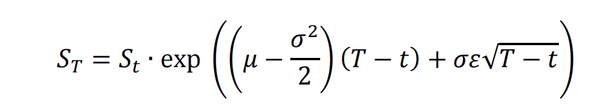

# snowball_pricing

## Introduction 
### What is 'Snowball'?

Snowball options, similar in nature to exotic options with barrier clauses, are unique financial instruments featuring knock-out and knock-in conditions. They are named for their similarity to a rolling snowball, where the conditions for the option's returns cna accumulate or 'snowball' under certain conditions. The idea is that as a snowball rolls down a hill, it can either grow larger, or it might hit a bump that causes it to break apart, or it could roll into a hole. The final outcome for the investor—much like the path of a snowball on a hillside—is uncertain and depends on whether these 'barrier' events occur during the life of the financial product. 

Financially, this translates into specific scenarios: if the price of the underlying asset rises to a certain level (knock-out price), the snowball product terminates early, and the investor receives a fixed return for the duration of the investment. If the price of the underlying asset falls to a certain level (knock-in price), then the profit or loss will be determined based on the underlying asset's price on the expiration date, and the investor may bear the risk of the underlying asset's price falling. If the underlying asset never touches the knock-in or knock-out price, the investor receives a fixed return for the entire duration of the product.

### Senario Analysis

- Underlying index: 000852（CSI1000）
- Product duration: 24 months
- Annual yield: 20%
- Knock-in level: Initial price x 103%
- Knock-out level: Initial price x 75%
- Knock-Out Event (Monthly Observation): On any knock-out day (every observation day), if the closing price of the linked underlying exceeds the knock-out level
- Knock-In Event (Daily Observation): On any knock-in observation day (every trading day), if the closing price of the linked underlying is below the knock-in level
- Earnings:
    - Knock-out (early termination of the contract): 20% x nominal principal x number of interest days / 365
    - Knock-in not knocked-out: min (final price / initial price - 1, 0) x principal
    - Neither Knock-In Nor Knock-Out: 20% x nominal principal x number of interest days / 365

## Monte Carlo Simulation

Since snowball options are path-dependent products, we can use the Monte Carlo Simulation method to price them. The essence of Monte Carlo Simulation is to simulate the random motion of the underlying variables. Based on the set volatility and risk-free interest rate, we generate N random price paths. Then, according to the revenue rules of the contract terms, we calculate the returns for each price path. The fair price of the current snowball product is the discounted value of the returns for all N paths back to the initial date, averaged out.

  

- St: The price of the underlying at time t.
- &mu;: The risk-free interest rate.
- &sigma;: The standard deviation of the underlying's returns (annualized volatility).
- (T - t): Time to maturity.
- &epsilon;: &epsilon; is normally distributed, &epsilon;∼N(0,1), representing the standard normal distribution. By sampling &epsilon;, we can simulate the price of the underlying.

